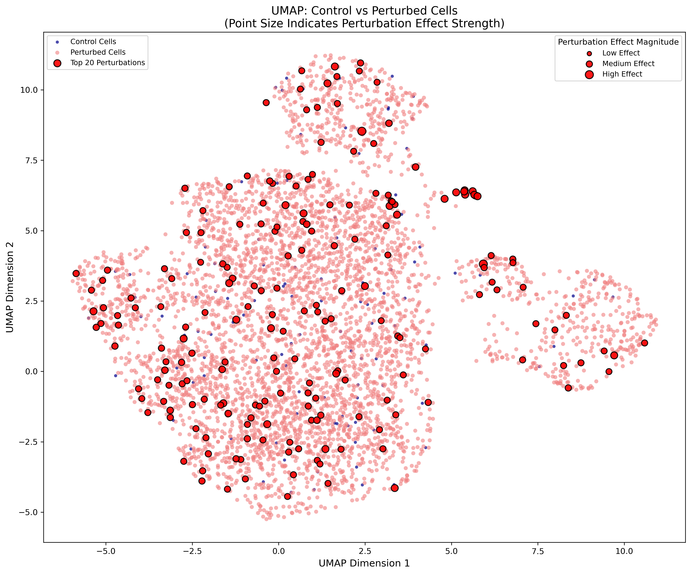

# 🧬 Discrepancy VAE for Perturbation Analysis

This repository contains a comprehensive pipeline for analyzing single-cell perturbation data using a Discrepancy Variational Autoencoder (DiscrepancyVAE). The primary goal is to understand how genetic perturbations affect gene expression in single cells. This project is designed to be a starting point for researchers and data analysts who want to explore perturbation effects in a structured and reproducible way.

## ✨ Key Features

*   **End-to-End Pipeline:** From data ingestion to model training and evaluation.
*   **Discrepancy VAE Model:** A powerful deep learning model for modeling perturbation effects.
*   **Configurability:** Easily customize the pipeline through YAML configuration files.
*   **Reproducibility:** Ensures that your results are reproducible through fixed seeds and environment setup.
*   **HPC Ready:** Includes scripts for running the pipeline on a Slurm cluster.

## 📊 Example Output

The pipeline generates several outputs, including a UMAP (Uniform Manifold Approximation and Projection) plot that visualizes the latent space of the cells. This plot helps to understand the relationships between different perturbations and their effects on gene expression.



In this UMAP, each point represents a single cell. Cells are colored by their perturbation status. You can see how cells with similar perturbations cluster together, and how they differ from the control cells.

## 🚀 Getting Started

Follow these steps to get the project up and running on your local machine.

### 1. Clone the Repository

```bash
git clone https://github.com/your-username/20250812-Disc-with-replogle.git
cd 20250812-Disc-with-replogle
```

### 2. Create the Conda Environment

This project uses Conda for environment management. The `environment.yml` file contains all the necessary dependencies.

```bash
conda env create -f environment.yml
conda activate disc-with-replogle
```

### 3. Run the Pipeline

The easiest way to run the entire pipeline is to use the `run_pipeline.py` script. This will execute all the steps from data ingestion to evaluation.

```bash
python run_pipeline.py all
```

This command will download the data, process it, train the model, and generate the evaluation results in the `outputs/` directory.

## 🛠️ Usage

You can also run individual steps of the pipeline. This is useful if you want to modify a specific part of the workflow.

### Running Individual Steps

Here are the available steps:

*   `ingest`: Download the dataset.
*   `process`: Preprocess the raw data.
*   `graphs`: Create a gene-gene interaction graph.
*   `train`: Train the DiscrepancyVAE model.
*   `evaluate`: Evaluate the trained model.

To run a specific step, use the following command:

```bash
python run_pipeline.py <step_name>
```

For example, to only run the data processing step:

```bash
python run_pipeline.py process
```

You can also run multiple steps in a sequence:

```bash
python run_pipeline.py ingest process train
```

## 📁 Project Structure

The repository is organized as follows:

```
.
├── configs/              # Configuration files for the pipeline
├── data/                 # Raw and processed data
├── notebooks/            # Jupyter notebooks for exploration
├── outputs/              # Output files (models, figures, logs)
├── scripts/              # Python and shell scripts for the pipeline
├── src/                  # Source code for the model and utilities
├── environment.yml       # Conda environment definition
├── run_pipeline.py       # Main pipeline script
└── README.md             # This file
```

## ⚙️ Configuration

The pipeline is configured using YAML files in the `configs/` directory. Here's a brief overview of the main configuration files:

| File                  | Description                               |
| --------------------- | ----------------------------------------- |
| `pipeline_config.yaml`| Main configuration for the entire pipeline.|
| `data_config.yaml`    | Parameters for data processing.           |
| `graph_config.yaml`   | Settings for graph construction.          |
| `model_config.yaml`   | Hyperparameters for the DiscrepancyVAE.   |

You can modify these files to change the behavior of the pipeline. For example, you can change the number of training epochs in `model_config.yaml`.

## 💻 HPC Execution

For large datasets, it is recommended to run the pipeline on a High-Performance Computing (HPC) cluster. This project includes a script for submitting the pipeline to a Slurm cluster.

To submit the pipeline to Slurm, use the following command:

```bash
sbatch scripts/slurm_pipeline.sh
```

This will execute the entire pipeline on a GPU node. You can customize the Slurm script (`scripts/run_pipeline_gpu.slurm`) to fit your cluster's configuration.

---

We hope this guide helps you get started with the project. If you have any questions or suggestions, please feel free to open an issue. Happy coding! 😊
